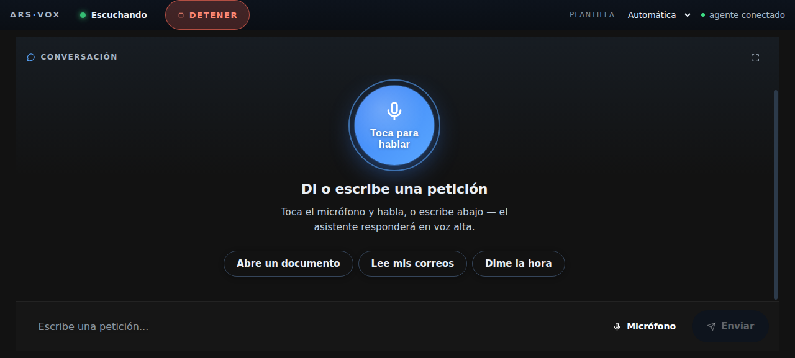

# Ars-Vox

A local-first voice agent that lets a non-technical elderly user operate a
computer entirely by speech — conversation, YouTube, books and documents,
news, notes, tasks, reminders, and messaging to one approved contact.



*Voice-first home: the user taps the mic and speaks; the assistant answers
aloud. The red DETENER (stop) control is always visible and never routes
through the LLM.*

## Why safety is the architecture, not a feature

The target user **cannot recover from an agent's mistake** — no undo, no
re-install, no reading error messages. So the design inverts the usual
priorities: capability is added only when it can be made safe.

| Mechanism | What it guarantees |
|---|---|
| Six-tier tool policy | Every tool classified (read-only → privileged); unknown tools are denied by default |
| Two-phase confirmation with SQLite snapshots | The approved action executes the *exact stored arguments* — the model cannot edit them after approval |
| EffectLedger rollback | Opt-in tools record their inverse during a turn; cancellation rolls them back LIFO |
| Point-of-no-return tracking | Cancellation is refused past irreversible boundaries instead of failing silently |
| Local stop path | Stop cancels the turn without ever consulting the model, network, or tool completion |
| Navigation policy | In-process Chromium engine rejects IPv4/IPv6 private and reserved destinations (SSRF guard, not just an allowlist) |

Confirmation prompts are written in plain Spanish ("Papá: llegamos tarde"
→ Aprobar / Rechazar), sized for low computer literacy.

## Architecture

```
apps/desktop/        Electron + React + Zustand + Vite
  src/layout/        deterministic pure-TS layout engine: the model selects
                     template + panels; geometry is computed, never generated
packages/contracts/  single source of truth for wire contracts (pydantic),
                     exported to JSON Schema for the TS side
services/agent/      FastAPI + WebSocket agent on PydanticAI: typed tools,
                     policy engine, confirmations, scheduler, audit trail
services/memory/     SQLite + FTS5: sessions, documents, reminders, audit
services/voice/      pipeline state machine: wake word / VAD / STT providers
services/tts/        pluggable TTS providers + priority queue
```

Key decisions:

- **The model never sends coordinates or pixels.** It returns typed
  `ui_command`s; the UI validates them again before applying anything.
- **Contracts first**: every message crossing the wire is defined once in
  `packages/contracts` and mirrored by schema conformance tests.
- **Deterministic layout**: pure functions of (LayoutSpec, Viewport), covered
  by Vitest — no LLM output in the math.
- **Verified end to end with real models**: scripted-mock CI path plus live
  runs against `deepseek-v4-flash` producing typed tool calls and layout
  commands; the full mic→VAD→STT→agent→TTS loop verified in a real browser.

## Evidence

- Python + cross-language pytest suite green (counts in [docs/STATUS.md](docs/STATUS.md));
  Vitest suite green, typecheck clean.
- Live-model proof: `scripts/demo_live.py` boots the service, sends a spoken-style
  request, asserts `tool_call → ui_command → tool_result → agent_message`.
- Written threat model ([docs/threat-model/](docs/threat-model/)) and ADRs under
  [docs/decisions/](docs/decisions/).

More screenshots: [docs/screenshots/](docs/screenshots/) — split layouts,
PDF/EPUB reading, browser panel, blocked-navigation refusal, confirmation flow,
restart persistence.

<details>
<summary>Running it</summary>

```bash
# Python service (mock mode needs no keys)
python -m venv .venv
.venv/bin/pip install -e packages/contracts -e services/memory \
  -e services/tts -e services/voice -e services/agent
.venv/bin/python scripts/smoke_mock.py          # one-shot event assertions

# Desktop
cd apps/desktop && npm install && npm run dev

# Live model
export OPENCODE_GO_API_KEY=...
.venv/bin/python -m arsvox_agent                # configs/app.yaml, mock: false
```

Configuration is a single validated YAML (`configs/app.yaml`); unknown keys are
rejected at startup. Tests: `.venv/bin/python -m pytest tests/python -q`,
`cd apps/desktop && npm test`.

</details>

<details>
<summary>Known limitations</summary>

- Real-microphone smoke test pending on the physical Windows machine (verified
  end-to-end with a fake audio device via CDP so far).
- TS types in the renderer are hand-mirrored from the Python contracts.
- Notes/settings panels and the WebContentsView browser still open.
- Local alarms cannot fire while the computer is off.

</details>
