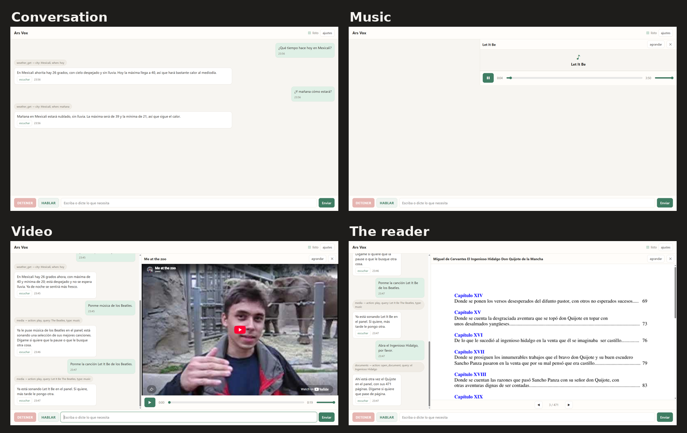
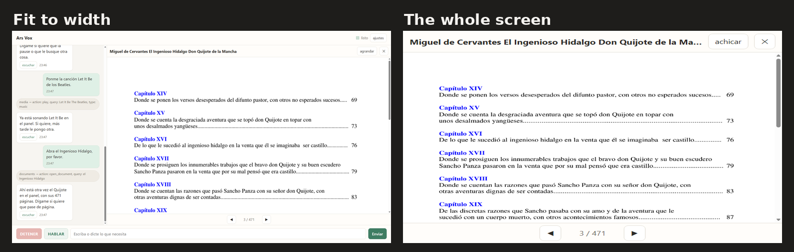

# Ars-Vox v2

A voice-first desktop assistant for one elderly Spanish-speaking user — Mexican
Spanish, addressed as *usted*. Talk or type; it answers out loud, and everything
it does stays visible on one window: the conversation on the left, a panel on
the right.

Refactor of `C:\dev\ars-vox` (archived, v0.1). The route is the harness anatomy
of arXiv 2609.00006; the plan lives at `C:\dev\ars-vox-refactor-plan.md`.



## What it does

- **Habla y escucha.** Push-to-talk or typed text; answers spoken aloud in the
  product voice (es-MX). A reminder, a task, a question — same door.
- **Reminders that ring.** "Recuérdame tomar la pastilla a las ocho" fires on
  time even with the app closed — Windows Task Scheduler owns it. Daily and
  weekly repeats included.
- **A simple task list.** "¿Qué tengo pendiente?" — add and list.
- **The web, on request.** Search, page reading, weather by city, news lists.
- **Music and video in the panel.** "Ponme a los Beatles" — the options are
  offered aloud with numbers and durations; picking plays the video in the
  panel, and when a video refuses to embed the assistant offers the sound path
  itself and the song plays — the user never sees an error.
- **Documents and books, shown as pages.** "Abrí el diario", "ábreme el
  Quijote" — it finds the user's own files under Documents / Desktop /
  Downloads; PDFs appear as their real pages, text books as page-sized pieces,
  fit to the panel's width, with page arrows and «pase la página». Public-domain
  classics that are not on disk can be brought home from Project Gutenberg.
  Books are *shown*, not narrated: reading books aloud is deferred on purpose.
- **A settings popup.** Two folders — books and music. Nothing else.



Failures the user cannot fix turn into an offer in the assistant's own words.
One always-visible stop control; status is one plain word.

## Run

The service is the product; the window is a page it serves.

```bash
python -m apps.cli.arsvox_cli serve          # 127.0.0.1:8790
```

Open `http://127.0.0.1:8790/`, or `msedge --app=http://127.0.0.1:8790/` for a
window without browser chrome. On Windows, `tools\windows\run_service.ps1`
starts it hidden with the CUDA paths and the key from `%USERPROFILE%\.arsvox\env`.

Headless drivers, for work without the window:

```bash
python -m apps.cli.arsvox_cli ask "ponme un video de los Beatles" --speak
python -m apps.cli.arsvox_cli talk           # voice in, voice out
python -m apps.cli.arsvox_cli transcribe clip.m4a
```

## For developers

`services/arsvox/` is the agent runtime, one module per harness subsystem;
`apps/desktop/` is the window page; `tests/` guards behavior. The state of every
wave, with its evidence, lives in `docs/status.md`.
